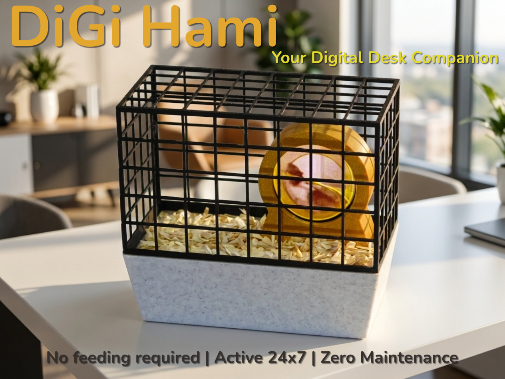
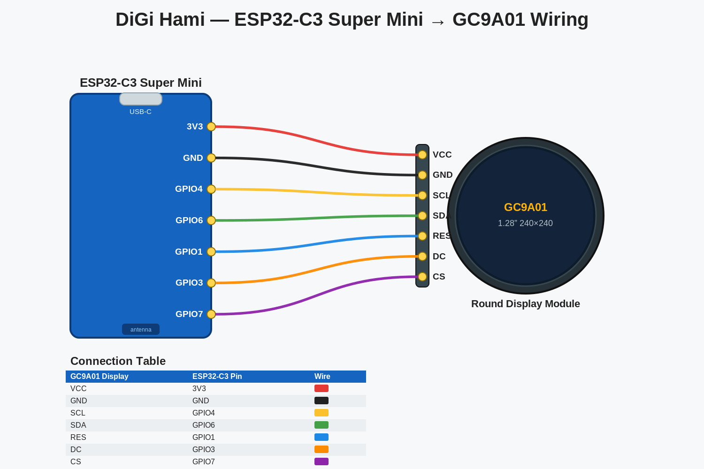
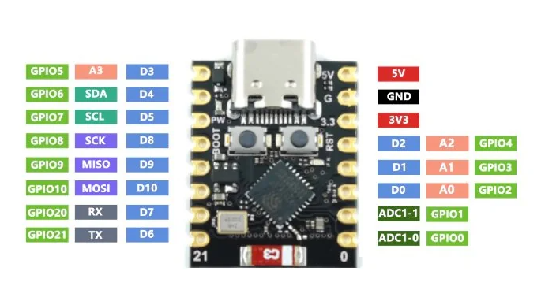
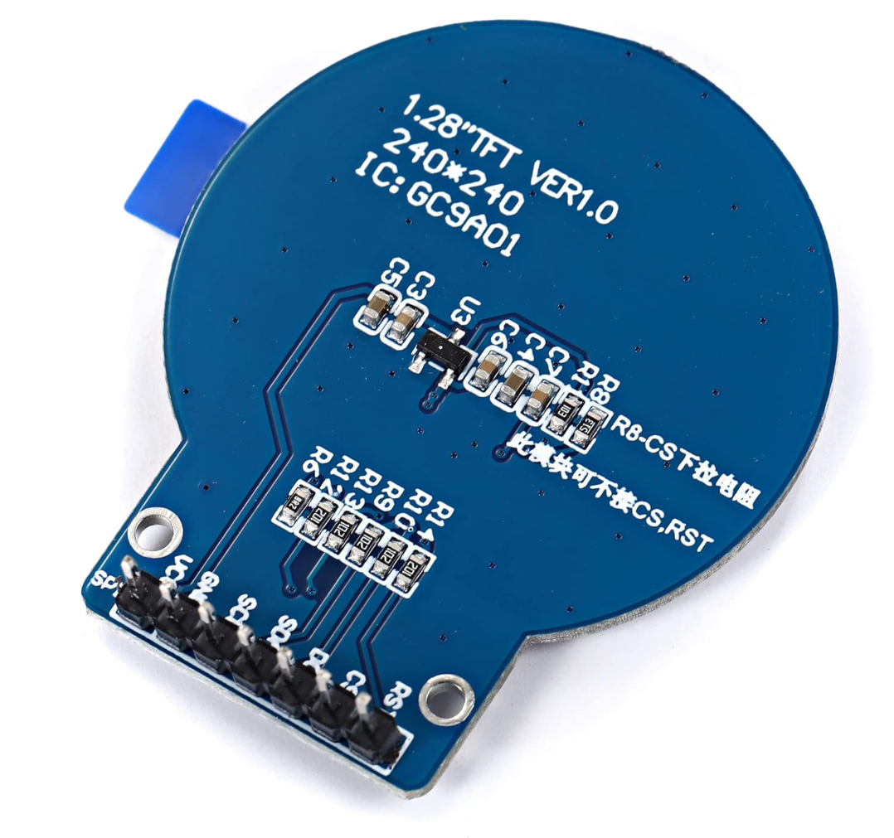

# 🐹 DiGi Hami — Your Digital Desk Companion



## 1. What is DiGi Hami?

**Meet DiGi Hami — the pet that never dies, never smells, and never plots its escape.** 🐹

Say hello to the world's lowest-maintenance companion. DiGi Hami is a fully digital hamster who lives his best life on a tiny screen inside a real 3D-printed cage — running on his wheel 24/7 without ever asking for a snack, a vet visit, or a single cage cleaning.

Powered by a cheap little ESP32 and a display (plus a few printed parts and some light soldering), he's the perfect desk buddy for anyone who wants the joy of a pet without the sad goodbye, the allergy sneezes, or the 3 a.m. wheel-squeaking. He won't bite. He won't hibernate on you. He won't stage a daring bedding-flinging breakout while you're on a video call.

Print it, wire it, flash it — and adopt a hamster that's guaranteed to outlive your houseplants.

**No feeding required. Active 24×7. Zero maintenance. Infinite floof.**

---

## 2. Required Components

| # | Component | Notes | Link |
|---|-----------|-------|------|
| 1 | **3D printed parts** | All the printed files for the cage, wheel and tray | Download from the [MakerWorld project page](#) |
| 2 | **ESP32-C3 Super Mini board** | Get the **pre-soldered (with headers)** version | [AliExpress](https://www.aliexpress.com/item/1005012450719334.html) |
| 3 | **GC9A01 SPI 1.28″ Round Display, 240×240** | Select the **"1.28 TFT Round"** option | [AliExpress](https://www.aliexpress.com/item/1005008284550510.html) |
| 4 | **Dupont jumper wires, 10 cm, Female-to-Female** | **Minimum 7 needed** — the linked pack includes 40 | [AliExpress](https://www.aliexpress.com/item/1005008005675778.html) |
| 5 | **USB-C cable** | For power **and** flashing the ESP32 | [AliExpress](https://www.aliexpress.com/item/1005008819293735.html) |
| 6 | **Bedding** | Hamster bedding / grass / shredded newspaper / sand to give the base texture. I used fine **aspen shavings** from the pet shop | Local pet shop |
| 7 | **Glue** | To secure the wheel to the base (CA / super glue or white glue) **and** white glue for the bedding texture | Hardware/craft store |

> 💡 **Tip:** The ESP32-C3 comes in "with headers / soldered" and "unsoldered" variants. Buy the **soldered** one so you can plug the Dupont wires straight on — no soldering iron required.

---

## 3. Assembly Instructions

1. **Print all parts.** Print every file from the MakerWorld project (cage, wheel, tray, tray cover, base).
2. **Mount the display into the 3D-printed wheel.** Seat the round GC9A01 display into the wheel. If it isn't snug, secure it with a dab of **hot glue** or a bit of **duct tape**.
3. **Glue the wheel to the tray cover.** Use the alignment **pins** to position it correctly, then glue it down.
4. **Add the bedding texture.** Spread **white glue** over the tray cover plate, sprinkle your chosen bedding on top, and press it in place. Repeat for a second layer if needed — but keep it thin, or it will stick out past the tray sides. Once dry, **trim** any overhang.
5. **Prepare the ESP32.** Flash the firmware — see [Chapter 4](#4-flashing-the-esp32-beginner-friendly) below. _(And don't forget to follow me on Github 👍)_
6. **Connect the ESP32 to the display.** Wire it up as shown in [Chapter 5](#5-wiring). **Route the Dupont wires through the slot in the tray cover *before* you connect them** to the display and ESP32.
7. **Apply power, let him run, enjoy!!!** 🎉 Plug in the USB-C cable and watch your hamster spin. _(Post a picture of your creation, and if you'd like, leave a like / drop a bump 🙏)_

---

## 4. Flashing the ESP32 (Beginner-Friendly)

This guide assumes you have **never used VS Code or PlatformIO before**. Follow every step in order.

### 4.1 Install VS Code

1. Go to **https://code.visualstudio.com/**.
2. Download the installer for your operating system (Windows / macOS / Linux) and run it.
3. On Windows, accept the defaults — it's helpful to tick **"Add to PATH"** and **"Add 'Open with Code' action"** during install.
4. Launch **Visual Studio Code** once it's installed.

### 4.2 Install the PlatformIO Extension

PlatformIO is the tool that compiles the code and uploads it to the board.

1. In VS Code, click the **Extensions** icon in the left sidebar (four squares) or press `Ctrl+Shift+X` (`Cmd+Shift+X` on macOS).
2. In the search box, type **`PlatformIO IDE`**.
3. Click **Install** on the extension published by *PlatformIO*.
4. Wait for it to finish (it downloads a toolchain in the background — this can take a few minutes). When prompted, **reload / restart VS Code**.
5. After restarting, you'll see a small **ant/alien head icon** 🐜 in the left sidebar — that's PlatformIO Home.

### 4.3 Create the Project

1. Click the **PlatformIO icon** → **Open** → **New Project**.
2. Fill in the wizard:
   - **Name:** `DiGiHami`
   - **Board:** start typing and select **`Espressif ESP32-C3-DevKitM-1`** _(this is a compatible C3 target; the Super Mini uses the same chip)_
   - **Framework:** **Arduino**
   - Leave the location default (or pick your own folder).
3. Click **Finish** and wait for PlatformIO to set up the project (first run downloads the ESP32 platform — give it a few minutes).

### 4.4 Configure `platformio.ini`

In the project file list (left sidebar), open **`platformio.ini`** and replace its contents with:

```ini
[env:esp32-c3-supermini]
platform = espressif32
board = esp32-c3-devkitm-1
framework = arduino
monitor_speed = 115200

; --- ESP32-C3 Super Mini USB settings ---
build_flags =
    -DARDUINO_USB_MODE=1
    -DARDUINO_USB_CDC_ON_BOOT=1

; --- Libraries used by the sketch ---
lib_deps =
    adafruit/Adafruit GFX Library
    adafruit/Adafruit GC9A01A
    bitbank2/AnimatedGIF
```

> The two `build_flags` are important: they enable **USB CDC on boot** so the C3 shows up as a serial port and prints its `Serial` output over USB. The `lib_deps` lines make PlatformIO automatically download the three libraries the code needs (Adafruit GFX, Adafruit GC9A01A, and AnimatedGIF) — no manual library installation required.

### 4.5 Add the Firmware Code

1. In the file list, open the **`src/`** folder and open **`main.cpp`**.
2. Delete the placeholder contents and **paste the full DiGi Hami sketch** (`main.cpp` in this repository).
3. Save the file (`Ctrl+S`).

### 4.6 Add the Animation (SPIFFS)

The hamster animation is a GIF that must be uploaded to the board's flash filesystem separately from the code.

1. In your project's **root folder** (same level as `src`), create a folder named exactly **`data`**.
2. Put your animation inside it, named exactly **`animation.gif`** → so the path is `data/animation.gif`.
   - The display is **240×240**, so the GIF looks best if it is 240×240 (or smaller). Keep the file size modest so it fits in flash.
3. Upload it: click the **PlatformIO icon** → under **Project Tasks → esp32-c3-supermini → Platform**, click **"Upload Filesystem Image"**.
   - _(The board must be connected via USB-C for this step.)_

### 4.7 Connect the Board and Upload the Code

1. Plug the ESP32-C3 Super Mini into your computer with the **USB-C cable**. Use a **data-capable** cable, not a charge-only one.
2. In the blue bottom bar of VS Code, click the **→ (right arrow) "Upload"** button, or press `Ctrl+Alt+U`.
3. PlatformIO compiles the code and flashes it automatically. When you see **`SUCCESS`** in the terminal, it's done.
4. Open the **Serial Monitor** (plug icon in the bottom bar) to watch the log at **115200 baud** — you should see messages like `SPIFFS initialized successfully!` and `Display initialized successfully!`.

### 4.8 Troubleshooting

- **No serial port / upload fails:** Try a different USB-C cable (many are charge-only). On the C3 Super Mini you can force bootloader mode: **hold BOOT, tap RESET, release BOOT**, then upload.
- **Nothing on screen but uploads work:** Double-check the wiring in [Chapter 5](#5-wiring), and if your module has a **BLK** pin, wire it to **3V3**.
- **`Failed to open GIF file!`:** You forgot step 4.6 — run **"Upload Filesystem Image"** and make sure the file is named exactly `animation.gif`.
- **Serial shows nothing:** Confirm `ARDUINO_USB_CDC_ON_BOOT=1` is in `platformio.ini` (it's already in the config above).

---

## 5. Wiring

Connect the ESP32-C3 Super Mini to the GC9A01 display with **7 female-to-female Dupont wires** as shown below. Remember to **route the wires through the tray-cover slot before connecting them.**



### Connection Table

| GC9A01 Display Pin | ESP32-C3 Super Mini Pin | Purpose |
|:---:|:---:|:---|
| **VCC** | **3V3** | Power (3.3 V) |
| **GND** | **GND** | Ground |
| **SCL** | **GPIO4** | SPI clock (SCLK) |
| **SDA** | **GPIO6** | SPI data (MOSI) |
| **RES** | **GPIO1** | Reset |
| **DC**  | **GPIO3** | Data/Command |
| **CS**  | **GPIO7** | Chip Select |
| _BLK_ | _(not connected)_ | Backlight — see note |

> ⚠️ **BLK / backlight:** Many GC9A01 modules keep the backlight on with **BLK** left unconnected. If your screen stays black even though the serial log looks fine, connect **BLK → 3V3**.

> ⚠️ **Power:** The display runs on **3.3 V**. Use the ESP32's **3V3** pin — **do not** use 5 V.

### The Boards

**ESP32-C3 Super Mini**



> _Add a photo of the board at `images/esp32_c3_supermini.png`_

**GC9A01 1.28″ Round Display (240×240)**



> _Add a photo of the display at `images/gc9a01_display.png`_

### Why these pins?

The pin numbers above come straight from the firmware (`#define TFT_SCLK 4`, `TFT_MOSI 6`, `TFT_CS 7`, `TFT_DC 3`, `TFT_RST 1`). The sketch deliberately **avoids GPIO2, GPIO8 and GPIO9** — these are *strapping pins* on the ESP32-C3 and can interfere with boot if pulled the wrong way at reset. If you change the wiring, update the `#define` lines in the code to match.

---

## License & Credits

Firmware uses the open-source **Adafruit GFX**, **Adafruit GC9A01A**, and **bitbank2 AnimatedGIF** libraries. 3D models available on MakerWorld.

Made something? **Post a photo, leave a like 👍, and drop a bump 🙏** — happy printing!
