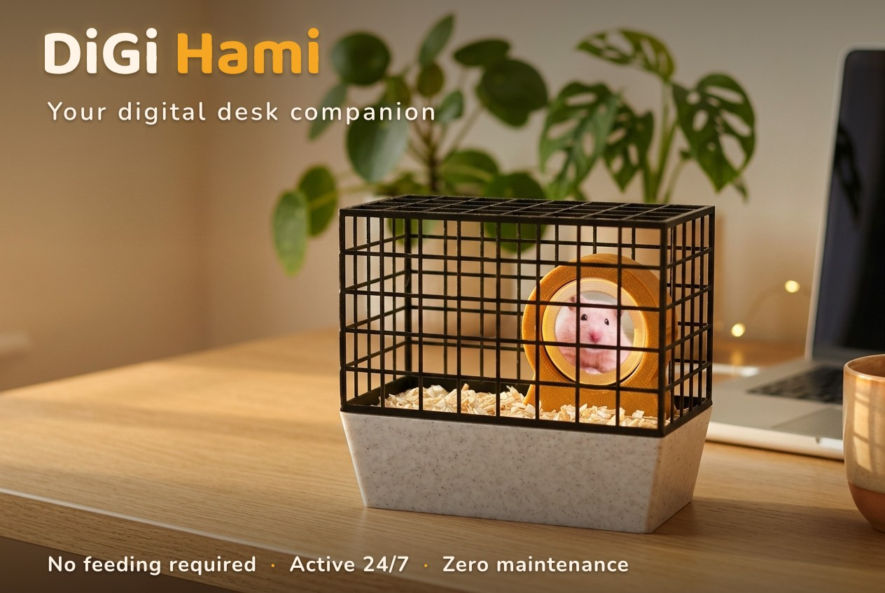
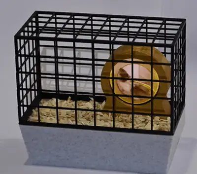
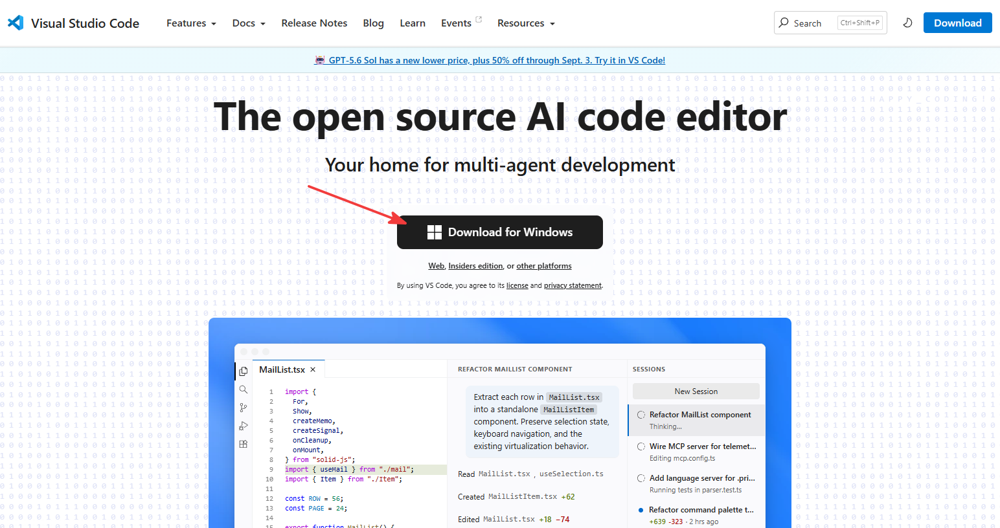
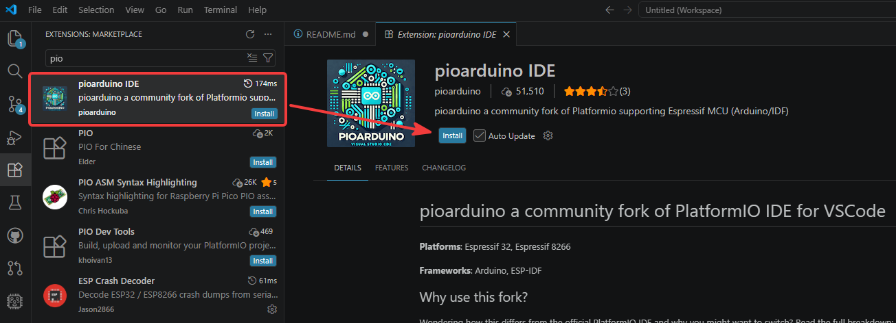
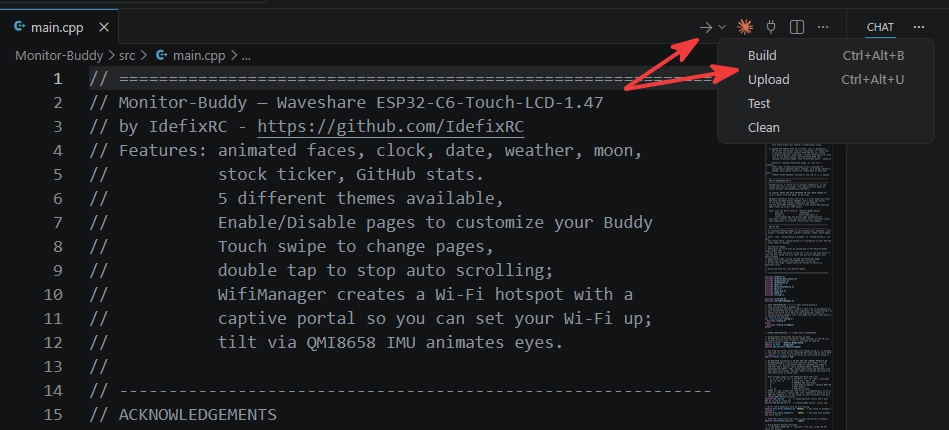
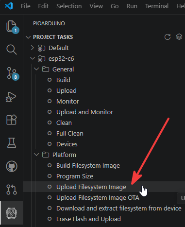

# 🐹 DiGi Hami — Your Digital Desk Companion

## 1. What is DiGi Hami?

**Meet DiGi Hami — the pet that never dies, never smells, and never plots its escape.** 🐹
(Beginner-friendly - detailed instructions below, no soldering required)

Say hello to the world's lowest-maintenance companion. DiGi Hami is a fully digital hamster who lives his best life on a tiny screen inside a real 3D-printed cage — running on his wheel 24/7 without ever asking for a snack, a vet visit, or a single cage cleaning.

Powered by a cheap little ESP32 and a display (plus a few printed parts), he's the perfect desk buddy for anyone who wants the joy of a pet without the sad goodbye, the allergy sneezes, or the 3 a.m. wheel-squeaking. He won't bite. He won't hibernate on you. He won't stage a daring bedding-flinging breakout while you're on a video call.

Print it, wire it, flash it — and adopt a hamster that's guaranteed to outlive your houseplants.

**No feeding required. Active 24×7. Zero maintenance. Infinite floof.**

Thanks to [deadpoh](https://www.instagram.com/_deadpohl_/) and [jknoepfel](https://github.com/jeremyknoepfel/hamster-wheel) for the initial design and inspiration for this excellent model.
I have expanded on the original design by improving the model with a slimmer mesh, self-centering cage, tray with a cover, wheel mount and cable cutouts, and by porting the code to an ESP32 C3 Super Mini .

**No feeding required. Active 24×7. Zero maintenance. Infinite floof.**

  

---

## 2. Required Components

| #   | Component                                        | Notes                                                                                                                          | Link                                                                                                                                |
| --- | ------------------------------------------------ | ------------------------------------------------------------------------------------------------------------------------------ | ----------------------------------------------------------------------------------------------------------------------------------- |
| 1   | **3D printed parts**                             | All the printed files for the cage, wheel and tray                                                                             | Download from the [MakerWorld project page](https://makerworld.com/en/models/3096322-digi-hami-your-digital-desk-hamster-companion) |
| 2   | **ESP32-C3 Super Mini board**                    | Get the **pre-soldered (with headers)** version                                                                                | [AliExpress](https://www.aliexpress.com/item/1005012450719334.html)                                                                 |
| 3   | **GC9A01 SPI 1.28″ Round Display, 240×240**      | Select the **"1.28 TFT Round"** option                                                                                         | [AliExpress](https://www.aliexpress.com/item/1005008284550510.html)                                                                 |
| 4   | **Dupont jumper wires, 10 cm, Female-to-Female** | **Minimum 7 needed** — the linked pack includes 40                                                                             | [AliExpress](https://www.aliexpress.com/item/1005008005675778.html)                                                                 |
| 5   | **USB-C cable**                                  | For power **and** flashing the ESP32                                                                                           | [AliExpress](https://www.aliexpress.com/item/1005008819293735.html)                                                                 |
| 6   | **Bedding**                                      | Hamster bedding / grass / shredded newspaper / sand to give the base texture. I used fine **aspen shavings** from the pet shop | Local pet shop                                                                                                                      |
| 7   | **Glue**                                         | To secure the wheel to the base (CA / super glue or white glue) **and** white glue for the bedding texture                     | Hardware/craft store                                                                                                                |

> 💡 **Tip:** The ESP32-C3 comes in "with headers / soldered" and "unsoldered" variants. Buy the **soldered** one so you can plug the Dupont wires straight on — no soldering iron required.

---

## 3. Assembly Instructions

1. **Print all parts.** Print every file from the MakerWorld project (cage, wheel, tray, tray cover, base).
2. **Mount the display into the 3D-printed wheel.** Seat the round GC9A01 display into the wheel. If it isn't snug, secure it with a dab of **hot glue** or a bit of **duct tape**.
3. **Glue the wheel to the tray cover.** Use the alignment **pins** to position it correctly, then glue it down.
4. **Add the bedding texture.** Spread **white glue** over the tray cover plate, sprinkle your chosen bedding on top, and press it in place. Repeat for a second layer if needed — but keep it thin, or it will stick out past the tray sides. Once dry, **trim** any overhang.
5. **Prepare the ESP32.** Flash the firmware — see [Chapter 4](#4-flashing-the-esp32-beginner-friendly) below. _(And don't forget to follow me on Github 👍)_
6. **Connect the ESP32 to the display.** Wire it up as shown in [Chapter 5](#5-wiring). **Route the Dupont wires through the slot in the tray cover _before_ you connect them** to the display and ESP32.
7. **Apply power, let him run, enjoy!!!** 🎉 Plug in the USB-C cable and watch your hamster spin. _(Post a picture of your creation, and if you'd like, leave a like / drop a bump 🙏)_

---

## 4. Flashing the ESP32 (Beginner-Friendly)

This guide assumes you have **never used VS Code or pioarduino before**. Follow every step in order.

> **How this differs from a typical ESP32 project:** the V1.0 download is already a complete, ready-to-open project. You don't create anything or paste any code — you open the folder, plug in the board, and click **Upload** once. The hamster animation is flashed automatically as part of that same click.

### 4.1 Download the DiGi Hami Release

1. Go to the **[Releases page](https://github.com/IdefixRC/DiGi_Hami/releases/latest)**.
2. Under **Assets**, download **`DiGi-Hami-v1.0.zip`**.
3. **Unzip** it somewhere easy to find, e.g. your Desktop. You get a folder named **`DiGi-Hami-v1.0`** containing:
   - **`platformio.ini`** — the build configuration, already set up for the ESP32-C3 Super Mini
   - the **`src/`** folder — `main.cpp`, the firmware
   - the **`data/`** folder — `animation.gif`, the hamster animation
   - the **`scripts/`** folder — the helper that auto-uploads the animation
   - this **`README.md`** and the `images/` folder

Throughout the rest of this chapter, this unzipped folder is your **DiGi Hami project folder**.

> _Prefer Git? `git clone https://github.com/IdefixRC/DiGi_Hami.git` gives you the same files. If you're not sure, use the release ZIP._

### 4.2 Install VS Code

1. Go to **https://code.visualstudio.com/**.
2. Download the installer for your operating system (Windows / macOS / Linux) and run it.
3. On Windows, accept the defaults — it's helpful to tick **"Add to PATH"** and **"Add 'Open with Code' action"** during install.
4. Launch **Visual Studio Code** once it's installed.

### 4.3 Install the pioarduino Extension

**pioarduino** is the tool that compiles the code and uploads it to the board. It's a community fork of PlatformIO that keeps up with the current ESP32 chips.

1. In VS Code, click the **Extensions** icon in the left sidebar (four squares) or press `Ctrl+Shift+X` (`Cmd+Shift+X` on macOS).
2. In the search box, type **`pioarduino`**.
3. Click **Install** on **"pioarduino IDE"** (publisher: _pioarduino_). Approve **"Trust Publisher & Install"** if asked.
4. Wait for it to finish (it downloads a small core in the background). When prompted, **reload / restart VS Code**.
5. After restarting you'll see an **alien-head icon** 👽 in the left sidebar — that's the pioarduino home.

> ⚠️ **Already have "PlatformIO IDE" installed?** The two extensions clash. Disable or uninstall **PlatformIO IDE** before using pioarduino.

### 4.4 Open the DiGi Hami Project

1. In VS Code, choose **File → Open Folder…**
2. Select your **DiGi Hami project folder** (the unzipped `DiGi-Hami-v1.0` folder from step 4.1) and open it.
3. If VS Code asks whether you trust the authors of the files, choose **Yes, I trust the authors**.
4. pioarduino recognises it as a project and runs a **one-time setup** — it downloads the ESP32 platform and the three libraries the firmware needs. This can take **a few minutes** on the first open; watch the status bar at the bottom and wait until it's finished.

> There's nothing to create and no code to paste — `platformio.ini` and `src/main.cpp` are already in the folder.

### 4.5 Connect the Board

1. Plug the ESP32-C3 Super Mini into your computer with the **USB-C cable**. Use a **data-capable** cable, not a charge-only one.
2. On Windows a driver installs automatically the first time — give it a few seconds.

### 4.6 Upload — Firmware + Animation, One Click

1. In the **Top bar** of VS Code, click the **→ (right arrow) "Upload"** button, or press `Ctrl+Alt+U`.
2. pioarduino runs three things in order:
   1. compiles the firmware,
   2. flashes it to the board,
   3. **automatically uploads the animation** (`data/animation.gif`) straight afterwards — you'll see a second step in the terminal titled _"Uploading filesystem image (data/animation.gif)"_.
3. When the terminal shows **`SUCCESS`** for **both** the firmware and the filesystem step, DiGi Hami is flashed.
4. Open the **Serial Monitor** (plug icon in the top toolbar) to watch the log at **115200 baud** — you should see `SPIFFS initialized successfully!`, `Display initialized successfully!`, then `Successfully opened GIF`.

### 4.7 Upload the Animation Manually (Fallback Only)

**You normally don't need this** — step 4.6 uploads the animation for you. Do this only if the serial log shows **`Failed to open GIF file!`** (for example the board re-enumerated too slowly right after the firmware flash).

1. Make sure the board is connected via USB-C.
2. Open the **pioarduino icon** in the left sidebar → **Project Tasks → esp32-c3-supermini → Platform** → click **"Upload Filesystem Image"**.

   
   - _(Equivalent terminal command: `pio run -t uploadfs`.)_

3. Re-open the Serial Monitor and confirm `Successfully opened GIF`.

> _Want your own animation? Replace `data/animation.gif` with your file — keep the exact name `animation.gif`. The display is **240×240**, so design for 240×240 or smaller and keep the file small so it fits in flash. Then upload again (step 4.6), or use the fallback above._

### 4.8 Troubleshooting

- **No serial port / upload fails:** Try a different USB-C cable (many are charge-only). On the C3 Super Mini you can force bootloader mode: **hold BOOT, tap RESET, release BOOT**, then upload.
- **Firmware uploads but the animation step fails:** Run the manual fallback in [step 4.7](#47-upload-the-animation-manually-fallback-only). If it keeps happening, unplug and replug the board first so the serial port settles.
- **Nothing on screen but uploads work:** Double-check the wiring in [Chapter 5](#5-wiring), and if your module has a **BLK** pin, wire it to **3V3**.
- **`Failed to open GIF file!` in the serial log:** The animation isn't on the board — run [step 4.7](#47-upload-the-animation-manually-fallback-only), and make sure the file is named exactly `animation.gif`.
- **Serial Monitor shows nothing:** The C3 must enumerate as a USB serial device. This project already sets `ARDUINO_USB_CDC_ON_BOOT=1` in `platformio.ini`, so just make sure you opened the folder from the release rather than recreating the project.
- **pioarduino setup seems stuck:** Allow the first open up to ~10 minutes on a slow connection. If it truly hangs, use the pioarduino home → **Miscellaneous → Clean**, then reopen the folder.

---

## 5. Wiring

Connect the ESP32-C3 Super Mini to the GC9A01 display with **7 female-to-female Dupont wires** as shown below. Remember to **route the wires through the tray-cover slot before connecting them.**

### Connection Table

| GC9A01 Display Pin | ESP32-C3 Super Mini Pin | Purpose              |
| :----------------: | :---------------------: | :------------------- |
|      **VCC**       |         **3V3**         | Power (3.3 V)        |
|      **GND**       |         **GND**         | Ground               |
|      **SCL**       |        **GPIO4**        | SPI clock (SCLK)     |
|      **SDA**       |        **GPIO6**        | SPI data (MOSI)      |
|      **RES**       |        **GPIO1**        | Reset                |
|       **DC**       |        **GPIO3**        | Data/Command         |
|       **CS**       |        **GPIO7**        | Chip Select          |
|       _BLK_        |    _(not connected)_    | Backlight — see note |

> ⚠️ **BLK / backlight:** Many GC9A01 modules keep the backlight on with **BLK** left unconnected. If your screen stays black even though the serial log looks fine, connect **BLK → 3V3**.

> ⚠️ **Power:** The display runs on **3.3 V**. Use the ESP32's **3V3** pin — **do not** use 5 V.

### The Boards

**ESP32-C3 Super Mini**

**GC9A01 1.28″ Round Display (240×240)**

### Why these pins?

The pin numbers above come straight from the firmware (`#define TFT_SCLK 4`, `TFT_MOSI 6`, `TFT_CS 7`, `TFT_DC 3`, `TFT_RST 1`). The sketch deliberately **avoids GPIO2, GPIO8 and GPIO9** — these are _strapping pins_ on the ESP32-C3 and can interfere with boot if pulled the wrong way at reset. If you change the wiring, update the `#define` lines in the code to match.

---

## License & Credits

Firmware uses the open-source **Adafruit GFX**, **Adafruit GC9A01A**, and **bitbank2 AnimatedGIF** libraries. 3D models available on MakerWorld.

Made something? **Post a photo, leave a like 👍, and drop a bump 🙏** — happy printing!
